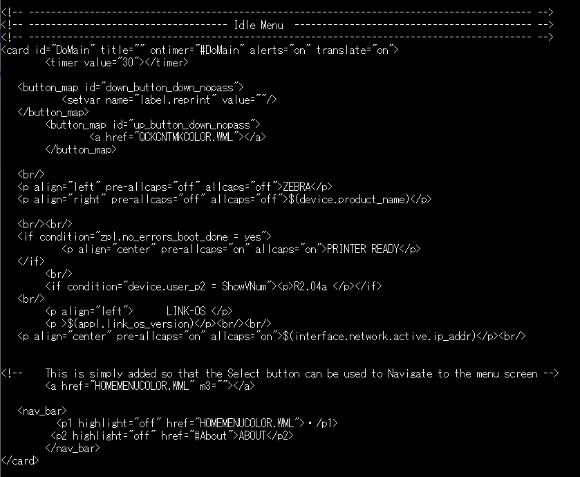

# Zebra-Printer_How to Upload Custom WML Files to Printers

* プリンタ標準のWMLファイル名を確認するコマンド。  
 
! U1 getvar "display.root_wml"
>例  
! U1 getvar "display.root_wml"  
"INDEXCOLOR.WML"  
※標準WMLはプリンタによって異なる。

 

---

 

1. 標準WMLの内容を確認する方法。  
既存のWMLを改変する人向け。  
! U1 do "file.type" "Z:[標準WML名]"
 
>注意）ZIHに著作権があるため、改変や配布の際はZebra Technologiesの許可を得ること。

>例  
>! U1 do "file.type" "Z:INDEXCOLOR.WML"  
> wml ファイルの内容が表示される。

 

---

 

1. カスタムしたWMLをアップロードする方法。
> a. 作成したコードを標準WML名で保存する。  
b. WMLファイルをFTP等を用いてプリンタのユーザ領域（Eドライブ）にアップロードする。  
c. プリンタを再起動する。  
d. 任意の画面構成が反映されているか確認する。  

> WMLエラーが発生する場合はアップロードしたWMLのファイル名や記述内容について確認すること。

 

---

 

* アップロードしたWMLを確認する際に用いるコマンド
>! U1 do "file.dir" "E"  
! U1 do "file.type" "E:[標準WML名]"

 

---

 

### WMLの記述方法
本家ZebraのProgramming Manual - WMLを確認すること。
https://docs.zebra.com/content/tcm/us/en/printers/software/zebra-zpl-ii,-zbi-2,-set-get-do,-mirror,-wml-programming-guide/c-zpl-wml-wireless-markup-language-wml/c-zpl-wml-using-wml/t-zpl-wml-create-sample-indexwml-file.html
